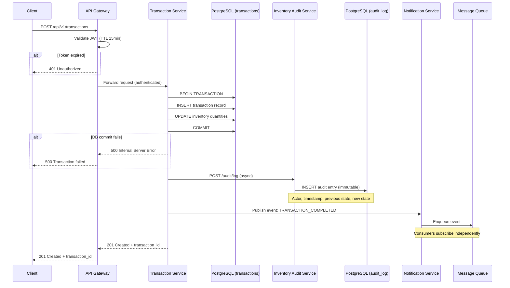
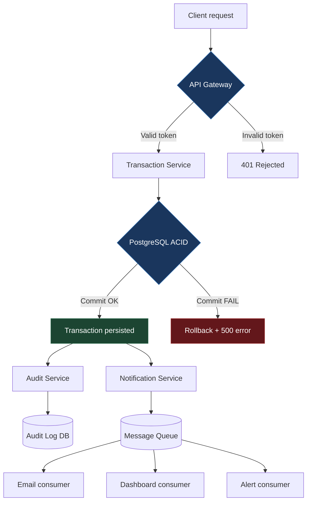

# Enterprise Transaction Management API

> Arquitectura de microservicios para gestión de transacciones y auditoría de inventarios corporativos.
> Java 17 · Spring Boot 3 · PostgreSQL · Docker

---

## Architecture overview

Sistema diseñado para operar como el backend transaccional de una organización que necesita trazabilidad completa sobre cada operación financiera y movimiento de inventario. Cada componente existe por una razón documentada — no hay servicios "por si acaso".

El sistema se estructura en cuatro capas con responsabilidades aisladas:

**API Gateway** — Punto de entrada único. Gestiona autenticación, rate limiting, y routing. Ningún servicio interno es accesible directamente desde el exterior. El gateway valida tokens JWT con rotación automática y TTL de 15 minutos.

**Transaction Service** — Núcleo del sistema. Procesa operaciones CRUD sobre transacciones financieras con validación de integridad en cada escritura. Opera con consistencia fuerte (strong consistency) contra PostgreSQL — cada transacción se confirma con ACID completo antes de devolver respuesta al cliente.

**Inventory Audit Service** — Servicio independiente que registra cada movimiento de inventario con timestamp, actor, y estado anterior/posterior. Funciona como log inmutable de auditoría. No modifica datos del inventario — solo registra. La separación entre "el servicio que modifica" y "el servicio que audita" garantiza que el audit trail no puede ser alterado por el mismo proceso que genera los cambios.

**Notification Service** — Publica eventos de negocio (transacción completada, alerta de stock, anomalía detectada) a una cola de mensajes. Los consumidores downstream se suscriben según necesidad. El servicio de notificaciones no conoce a sus consumidores — publica y desacopla.

```
┌─────────────────────────────────────────────────────────────────┐
│                         API Gateway                             │
│              JWT Auth · Rate Limit · Routing                    │
└──────────┬──────────────────┬───────────────────┬───────────────┘
           │                  │                   │
           ▼                  ▼                   ▼
┌──────────────────┐ ┌────────────────────┐ ┌─────────────────────┐
│  Transaction     │ │  Inventory Audit   │ │  Notification       │
│  Service         │ │  Service           │ │  Service            │
│                  │ │                    │ │                     │
│  CRUD + ACID     │ │  Immutable log     │ │  Event publishing   │
│  Strong consist. │ │  Read-only audit   │ │  Async + decoupled  │
└────────┬─────────┘ └─────────┬──────────┘ └──────────┬──────────┘
         │                     │                       │
         ▼                     ▼                       ▼
┌──────────────────┐ ┌────────────────────┐ ┌─────────────────────┐
│   PostgreSQL     │ │   PostgreSQL       │ │   Message Queue     │
│   (transactions) │ │   (audit_log)      │ │   (events)          │
└──────────────────┘ └────────────────────┘ └─────────────────────┘
```

---

## Sequence diagram (Mermaid)

Copiar el siguiente bloque y pegarlo en cualquier renderer de Mermaid (GitHub lo renderiza nativamente en archivos `.md`, también funciona en mermaid.live):



**Flow diagram alternativo** — vista de alto nivel del ciclo de vida de una transacción:



---

## Design decisions (ADR)

### ADR-001: PostgreSQL por integridad referencial — no NoSQL

**Contexto:** El sistema procesa transacciones financieras que requieren trazabilidad completa. Cada registro debe mantener relaciones verificables con otros registros (transacción → items → inventario → auditoría).

**Decisión:** PostgreSQL con esquema relacional estricto, foreign keys enforced, y constraints de integridad en cada tabla.

**Alternativas evaluadas:**
- MongoDB: Mejor performance en escrituras de alto volumen, esquema flexible. Descartada porque la flexibilidad de esquema es un riesgo en datos financieros — un documento mal formado puede pasar silenciosamente sin validación de foreign keys.
- DynamoDB: Escalabilidad automática, pricing por request. Descartada porque el modelo key-value no soporta joins nativos, y las consultas de auditoría requieren cruzar transacciones con inventario con frecuencia.

**Consecuencias:** Mayor rigidez en cambios de esquema (requiere migraciones formales). Menor throughput en escrituras concurrentes comparado con NoSQL. A cambio, garantía absoluta de que si un registro de transacción referencia un item de inventario, ese item existe. En datos financieros, esa garantía no es negociable.

---

### ADR-002: Separación física de servicio de auditoría

**Contexto:** El audit trail es un requisito regulatorio. Cada movimiento de inventario y cada transacción financiera debe tener un registro inmutable de quién hizo qué, cuándo, y cuál era el estado anterior.

**Decisión:** El servicio de auditoría opera en un proceso independiente con su propia base de datos. No comparte esquema, conexión, ni credenciales con el servicio de transacciones.

**Alternativas evaluadas:**
- Triggers de base de datos: Implementar auditoría como triggers SQL en la misma DB de transacciones. Descartada porque el proceso que genera el cambio y el proceso que lo audita compartirían el mismo contexto de ejecución — un bug o un actor malicioso con acceso a la DB podría alterar tanto el dato como su registro de auditoría.
- Event sourcing completo: Registrar cada operación como evento inmutable y derivar el estado actual por replay. Evaluada seriamente pero descartada por complejidad operacional — el equipo necesita poder hacer queries directos sobre el estado actual sin reconstruir la cadena de eventos.

**Consecuencias:** Mayor complejidad de infraestructura (dos bases de datos, dos servicios, comunicación asincrónica entre ellos). Latencia adicional de ~50-100ms en el registro de auditoría. A cambio, aislamiento total: si el servicio de transacciones se compromete, el audit log es intocable.

---

### ADR-003: JWT con TTL corto (15 min) + rotación automática

**Contexto:** El sistema expone una API REST que procesa datos financieros sensibles. La autenticación debe balancear seguridad con usabilidad.

**Decisión:** JWT con Time-to-Live de 15 minutos. El cliente recibe un access token (15 min) y un refresh token (7 días, single-use). Cada uso del refresh token genera un par nuevo y revoca el anterior.

**Alternativas evaluadas:**
- Sesiones server-side con Redis: Control total de revocación instantánea. Descartada porque introduce un single point of failure (Redis) y acopla el estado de sesión al servidor — incompatible con escalabilidad horizontal donde cualquier instancia del gateway debe poder validar un token sin consultar estado compartido.
- JWT con TTL largo (24h): Reduce la frecuencia de renovación. Descartada porque una ventana de 24 horas de token válido es inaceptable para datos financieros — un token robado tiene 24 horas de acceso total.

**Consecuencias:** El cliente debe implementar lógica de renovación automática (interceptor HTTP que detecta 401, usa refresh token, y reintenta). Complejidad adicional en el frontend. A cambio, la ventana de exposición de un token comprometido es de máximo 15 minutos, y la rotación del refresh token garantiza que un refresh robado solo funciona una vez.

---

## Trade-offs

| Decisión | Lo que gané | Lo que sacrifiqué |
|----------|-------------|-------------------|
| PostgreSQL sobre NoSQL | Integridad referencial absoluta, constraints ACID, joins nativos para auditoría | Throughput en escrituras concurrentes. Escalabilidad horizontal requiere sharding manual (vs. auto-scaling de DynamoDB) |
| Audit service separado | Aislamiento de seguridad total. El audit trail sobrevive a un breach del servicio principal | Latencia de 50-100ms adicional en cada operación auditada. Dos bases de datos que mantener, monitorear, y respaldar |
| JWT TTL 15 min | Ventana de exposición mínima. Stateless = escalabilidad horizontal sin estado compartido | El cliente debe manejar renovación automática. Experiencia degradada si el refresh falla (re-login forzado) |
| Microservicios sobre monolito | Despliegue independiente de cada servicio. Un bug en notificaciones no tumba transacciones | Complejidad operacional significativa. Debugging distribuido. Latencia de red entre servicios |
| Consistencia fuerte sobre eventual | Cada lectura refleja la última escritura. No hay ventana donde un usuario ve datos desactualizados | Latencia en escrituras (~20ms adicional por commit ACID). No escala horizontalmente tan fácil como un sistema eventually consistent |

---

## Stack técnico

| Capa | Tecnología | Justificación |
|------|-----------|---------------|
| Runtime | Java 17 (LTS) | Estabilidad, soporte enterprise a largo plazo, ecosystem de Spring |
| Framework | Spring Boot 3.x | Auto-configuración, dependency injection, actuator para health checks |
| Persistencia | PostgreSQL 15 | Integridad referencial, JSONB para campos flexibles sin sacrificar SQL |
| ORM | Spring Data JPA + Hibernate | Mapping declarativo, migraciones con Flyway |
| Auth | Spring Security + JWT (jjwt) | Stateless auth compatible con escalabilidad horizontal |
| Mensajería | RabbitMQ | Colas durables, dead-letter queues, routing por exchange |
| Contenedores | Docker + Docker Compose | Entorno reproducible, aislamiento de servicios |
| Testing | JUnit 5 + Testcontainers | Tests de integración contra PostgreSQL y RabbitMQ reales, no mocks |
| Observabilidad | Spring Actuator + Micrometer | Métricas JVM, health endpoints, ready para Prometheus |

---

## Cómo ejecutar

```bash
# Clonar el repositorio
git clone https://github.com/santiago-levi/enterprise-transaction-api.git
cd enterprise-transaction-api

# Levantar infraestructura (PostgreSQL + RabbitMQ)
docker-compose up -d

# Ejecutar migraciones
./mvnw flyway:migrate

# Levantar la aplicación
./mvnw spring-boot:run

# Ejecutar tests (incluye integration tests con Testcontainers)
./mvnw verify
```

**Requisitos:** Java 17+, Docker, Maven 3.8+

---

## Estructura del proyecto

```
enterprise-transaction-api/
├── docker-compose.yml
├── pom.xml
├── docs/
│   ├── ADR-001-postgresql-over-nosql.md
│   ├── ADR-002-separated-audit-service.md
│   ├── ADR-003-jwt-short-ttl.md
│   └── architecture-overview.png
├── transaction-service/
│   ├── src/main/java/.../
│   │   ├── controller/        # REST endpoints
│   │   ├── service/           # Business logic
│   │   ├── repository/        # JPA repositories
│   │   ├── model/             # Entity classes
│   │   ├── dto/               # Request/Response DTOs
│   │   ├── config/            # Security, CORS, JWT config
│   │   └── exception/         # Global exception handler
│   └── src/test/java/.../
├── audit-service/
│   ├── src/main/java/.../
│   │   ├── listener/          # Event consumers
│   │   ├── repository/        # Audit log persistence
│   │   └── model/             # Immutable audit entries
│   └── src/test/java/.../
└── notification-service/
    ├── src/main/java/.../
    │   ├── publisher/         # Event producers
    │   └── config/            # RabbitMQ exchange config
    └── src/test/java/.../
```

---

## Documentación de decisiones

Cada decisión de arquitectura está documentada como un ADR (Architecture Decision Record) en `/docs/`. El formato sigue el template de Michael Nygard: contexto, decisión, alternativas evaluadas, consecuencias.

Documento cada trade-off no porque alguien lo requiera, sino porque opero bajo un modelo de transparencia radical. En un entorno autogestionado, la documentación técnica de nivel consultoría es lo que elimina la dependencia jerárquica — cualquier persona del equipo puede entender por qué el sistema está diseñado así sin necesitar una reunión de transferencia de conocimiento.

---

## Autor

**Santiago Levi** — Cloud Architect · System Internals & Kernel Linux
16 años diseñando, optimizando y resolviendo problemas a nivel de sistema operativo.

[LinkedIn](https://www.linkedin.com/in/santiago-levi-dev) · [GitHub](https://github.com/ellevi81)

---

## Licencia

MIT
